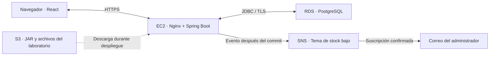

# TechStore · Gestión de inventario

Aplicación web académica para gestionar el inventario de **STG Technology & Logistics S.A.C.** Permite administrar el catálogo, registrar entradas y salidas con Kardex, consultar indicadores y exportar datos a Excel.

El frontend utiliza **React 19** y el backend **Java 21 / Spring Boot 4** con **PostgreSQL**. Incluye una integración opcional con **Amazon SNS** para avisos de stock bajo y una guía de laboratorio de cuatro horas con **EC2, RDS, S3 y SNS**.

## Funcionalidades

- Productos, categorías y marcas; validación de SKU y estados del catálogo.
- Entradas y salidas con usuario, fecha, cantidades, documentos y observaciones.
- Actualización de stock y registro del movimiento en una sola transacción, con bloqueo del producto para controlar operaciones simultáneas.
- Precios e historial con `BigDecimal` y columnas `NUMERIC(12,2)`.
- Dashboard con totales, valor del inventario, gráficos y listado de stock bajo.
- Usuarios, roles y permisos por módulo; exportaciones a Excel protegidas por permisos.
- Mi Perfil: edición de nombre y correo, cambio de contraseña y preferencias de avisos.
- Avisos SNS por correo cuando una salida cruza el umbral de stock mínimo.

## Arquitectura

En desarrollo, Vite redirige `/api` y `/export` al backend. En el build de producción, React se incorpora al mismo JAR que Spring Boot.



Este diagrama representa el despliegue de la guía. S3 almacena archivos; el frontend se sirve desde EC2. Los registros del catálogo y los movimientos se guardan en PostgreSQL.

## Tecnologías

| Área | Tecnologías |
|---|---|
| Backend | Java 21, Spring Boot 4.0.6, Spring Web, Spring Security, Bean Validation |
| Persistencia | Spring Data JPA, Hibernate, PostgreSQL 15 en desarrollo |
| Frontend | React 19, Vite 6, React Router 7, Bootstrap 5, Font Awesome 6 |
| Gráficos y reportes | Chart.js, react-chartjs-2, Apache POI |
| AWS | SDK Java v2 para SNS; plantillas de IAM, systemd y Nginx para el laboratorio |
| Herramientas | Maven Wrapper, npm con lockfile, Docker Compose para PostgreSQL local |

## Inicio local

Requisitos: **JDK 21 o superior**, **Node.js 20 o superior** y Docker Compose, o PostgreSQL local con la configuración equivalente.

### 1. Obtener el proyecto y levantar PostgreSQL

```bash
git clone https://github.com/Andre1825/TechStore.git
cd TechStore
docker compose up -d
```

El contenedor crea `techstore_db` en el puerto `5432`. Las credenciales de ejemplo de `docker-compose.yml` y `application.properties` son exclusivamente para desarrollo local.

### 2. Definir la contraseña inicial

Antes del primer arranque, define `ADMIN_PASSWORD`: mínimo **12 caracteres** y máximo **72 bytes UTF-8**. Se usa para crear `admin` si todavía no hay usuarios; no cambia la contraseña de cuentas existentes.

En **PowerShell**, solicita el valor sin escribirlo en el historial:

```powershell
$bootstrapSecret = Read-Host 'Contraseña inicial de admin' -AsSecureString
$env:ADMIN_PASSWORD = [System.Net.NetworkCredential]::new('', $bootstrapSecret).Password
.\mvnw.cmd spring-boot:run
```

En **Bash**:

```bash
read -r -s -p 'Contraseña inicial de admin: ' ADMIN_PASSWORD
printf '\n'
export ADMIN_PASSWORD
./mvnw spring-boot:run
```

El backend escucha en `http://localhost:8080`. El entorno de desarrollo puede cargar categorías, marcas y productos de ejemplo; para omitirlos utiliza `--techstore.seed-demo-data=false` como argumento de la aplicación.

### 3. Iniciar React en otra terminal

```bash
cd frontend
npm ci
npm run dev
```

Abre **http://localhost:5173** e inicia sesión con `admin` y la contraseña elegida. Desde Usuarios puedes crear las demás cuentas.

**En producción no se carga el catálogo de demostración.** RDS es una base separada de tu PostgreSQL local: desplegar el JAR no copia sus registros.

## Seguridad

- Contraseñas almacenadas mediante hash BCrypt; sin contraseña inicial fija.
- Bloqueo tras tres intentos de acceso fallidos y sesión con 15 minutos de inactividad máxima.
- Protección CSRF en login, logout y modificaciones. React obtiene el token en `GET /api/auth/csrf` y lo envía en las peticiones de escritura.
- Rotación del identificador de sesión al autenticar y revocación al cambiar contraseñas, bloquear cuentas o modificar roles/permisos.
- Autorización por permisos de módulo, también para exportaciones.
- Validación de cantidades enteras, importes, tamaños de texto y referencias del catálogo.
- Perfil `prod` con cookie `Secure`, `HttpOnly` y acceso mediante proxy HTTPS.

Si una base antigua conserva `admin / 123456`, cambia esa contraseña desde Mi Perfil en desarrollo antes de activar `prod`: el arranque de producción rechaza ese acceso conocido.

## Avisos de stock por correo

Con SNS habilitado, una cuenta activa con `GESTIONAR_USUARIOS` puede guardar su correo en **Mi Perfil → Editar datos**, solicitar los avisos y confirmar la suscripción desde el mensaje de Amazon SNS.

La aplicación publica después de confirmar una **salida** que pasa de stock superior al mínimo a stock menor o igual al mínimo, siempre que el mínimo sea positivo. Por ejemplo, con mínimo `3`, pasar de `10` a `3` dispara un aviso; pasar después de `3` a `2` no repite el aviso. Reponer por encima del mínimo permite un nuevo aviso al cruzarlo otra vez.

Cambiar el correo desactiva la preferencia y exige una nueva solicitud. Los mensajes se filtran por destinatario. El botón de solicitud no acredita que el usuario haya confirmado el correo. No se envían avisos retroactivos al activar la función ni al editar el mínimo.

| Variable | Valor / propósito |
|---|---|
| `SNS_ENABLED` | `false` por defecto; `true` para habilitar SNS |
| `AWS_REGION` | Región del tema, por defecto `us-east-1` |
| `SNS_TOPIC_ARN` | ARN de un tema SNS Standard en esa región |

En EC2, el SDK utiliza las credenciales temporales del **rol IAM de la instancia**. Los permisos y la configuración se detallan en la guía AWS.

## Compilar y desplegar

```bash
./mvnw package -Pprod -DskipTests
```

En Windows usa `.\mvnw.cmd`. El perfil Maven `prod` instala Node en `target/`, ejecuta `npm ci`, compila React y produce:

```text
target/tech-store-project-0.0.1-SNAPSHOT.jar
```

`-DskipTests` omite la ejecución de las pruebas; este comando es de empaquetado. El perfil Maven de build y el perfil Spring de ejecución se activan por separado:

```bash
java -jar target/tech-store-project-0.0.1-SNAPSHOT.jar --spring.profiles.active=prod
```

Configura previamente `DB_URL`, `DB_USERNAME`, `DB_PASSWORD` y, para una base sin usuarios, `ADMIN_PASSWORD`. El acceso web con `prod` requiere HTTPS; para RDS, la guía configura JDBC con TLS y verificación del certificado.

| Documentación | Contenido |
|---|---|
| [Laboratorio AWS de cuatro horas](deploy/GUIA-AWS-4-HORAS.md) | EC2 + RDS + S3 + SNS: consola, comandos, IAM, HTTPS, prueba funcional y limpieza |
| [Plantillas AWS](deploy/aws-lab/) | Servicio systemd, proxy Nginx, variables de ejemplo y políticas IAM/S3 |
| [Configuración y alcance de las mejoras](deploy/MEJORAS-SEGURIDAD.md) | Bootstrap, sesiones, validaciones, verificaciones y pendientes |
| [Despliegue en Windows Server](deploy/README-DESPLIEGUE.md) | Nginx, HTTPS y servicio con WinSW |

Las plantillas AWS requieren sustituir el ID de cuenta de ejemplo `123456789012`, bucket, ARN y demás marcadores por los de tu entorno. El laboratorio contempla una instancia de aplicación y RDS Single-AZ; no proporciona alta disponibilidad.

## API principal

Los roles agrupan permisos configurables. Los permisos indicados abajo corresponden a las restricciones del backend.

| Recurso | Rutas principales | Acceso |
|---|---|---|
| Sesión | `GET /api/auth/csrf`, `POST /api/auth/login`, `POST /api/auth/logout` | Público; escrituras con CSRF |
| Perfil | `GET /api/auth/me`, `PUT /api/auth/profile`, `POST /api/auth/password` | Cuenta autenticada |
| Avisos | `POST /api/auth/stock-alerts/subscribe`, `DELETE /api/auth/stock-alerts` | `GESTIONAR_USUARIOS` |
| Catálogo | `/api/categorias`, `/api/marcas`, `/api/productos` | Lectura autenticada; escritura con permiso de gestión del módulo |
| Entradas | `/api/entradas` | `REGISTRAR_ENTRADAS` |
| Salidas | `/api/salidas` | `REGISTRAR_SALIDAS` |
| Kardex | `/api/movimientos` | `VER_MOVIMIENTOS` |
| Dashboard | `/api/dashboard` | `VER_DASHBOARD` |
| Administración | `/api/usuarios`, `/api/roles` | `GESTIONAR_USUARIOS` / `GESTIONAR_ROLES` |
| Excel | `/export/productos.xlsx`, `/export/movimientos.xlsx` | `GESTIONAR_PRODUCTOS` / `VER_MOVIMIENTOS` |

## Verificación y pendientes

La suite versionada contiene una prueba de carga del contexto Spring. Requiere PostgreSQL disponible y la configuración de bootstrap correspondiente:

```bash
./mvnw test
```

Durante la implementación se realizaron **88 comprobaciones locales auxiliares**: 75 de API/inventario con H2 temporal y SNS simulado, 7 de transporte/configuración SNS sin llamadas AWS y 6 de arranque en producción. Cubrieron permisos, CSRF, revocación, concurrencia, rollback, perfil y umbrales de avisos. Esos verificadores temporales no forman parte de la suite versionada; H2 no sustituye una validación con PostgreSQL/RDS.

Pendientes para evolucionar el proyecto:

- Incorporar migraciones de esquema y pruebas automatizadas de integración reproducibles; actualmente se mantiene `ddl-auto=update`. Respaldar bases existentes antes de actualizar las columnas de precio.
- Coordinar sesiones entre instancias antes de escalar horizontalmente; el registro actual reside en un proceso Java.
- Añadir entrega duradera de avisos y reintentos persistentes: la cola actual es local y los fallos se registran. SNS Standard puede entregar duplicados.
- Resolver las alertas de dependencias frontend reportadas en la revisión previa; esa actualización permanece pendiente.
- Verificar esquema y flujo de correo en el entorno PostgreSQL/RDS/SNS de cada despliegue.

## Estructura

```text
TechStore/
├── docker-compose.yml
├── pom.xml
├── mvnw / mvnw.cmd
├── src/main/java/com/techstore/tech_store_project/
│   ├── config/          # Seguridad, bootstrap y configuración AWS
│   ├── controller/      # API REST y exportaciones
│   ├── dto/             # Solicitudes validadas
│   ├── model/           # Entidades JPA
│   ├── notification/    # Eventos y transporte SNS
│   ├── repository/      # Persistencia y bloqueos
│   └── service/         # Inventario, usuarios y avisos
├── src/main/resources/  # Configuración Spring
├── src/test/            # Prueba de contexto
├── frontend/src/        # SPA React
└── deploy/              # Guías y plantillas de despliegue
```

## Autores

- Quispe Sánchez Juan André
- Mauricio Lopez Sebastian Alessandro
- Salazar Bustamante Angelo Gianpiero
- Cerna Martinez Arian
- Sullcapuma Bustamante Jaren John

Proyecto académico — UTP 2026.