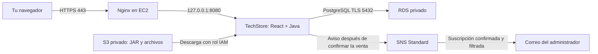

# TechStore en AWS: EC2 + RDS + S3 + SNS

Guía de laboratorio para alguien que todavía no ha desplegado una aplicación en AWS. Preparada el 5 de octubre de 2026 para tu sandbox de cuatro horas. Los nombres de algunos botones pueden variar según el idioma de la consola.

**Resultado esperado:** abrir TechStore por HTTPS, guardar el inventario en RDS PostgreSQL, obtener el archivo de la app desde un bucket S3 privado y recibir un aviso de stock bajo en el correo guardado en Mi Perfil.

Esta guía contiene pasos para que los ejecutes tú. No se han creado recursos AWS ni se ha probado una entrega real de correo desde este equipo.

Las plantillas usan el ID de cuenta ficticio **`123456789012`**. Sustitúyelo por el ID de tu sandbox en todos los ARN de SNS/KMS y comandos. Un ID de cuenta o ARN identifica recursos; no autentica una sesión CLI/SDK. El Canonical user ID no se necesita porque usaremos roles IAM y ACL desactivadas en S3. Comprueba la cuenta activa en cada sesión.

## 1. Qué hace cada servicio

| Servicio | Uso concreto en este proyecto | Qué practicarás |
|---|---|---|
| EC2 | Ejecutar el JAR que contiene React y Java | Instancias, SSH, Linux, servicios, registros y HTTPS |
| RDS PostgreSQL | Guardar productos, usuarios, roles y movimientos | Base administrada, endpoint, acceso privado y TLS |
| S3 | Guardar el JAR, archivos de configuración sin secretos, exportaciones y un backup opcional | Buckets privados, objetos, prefijos, versiones y permisos |
| SNS | Suscribir el correo del administrador y enviar avisos de stock bajo | Temas Standard, confirmación por correo, filtros y publicación |
| IAM y VPC | Dar permisos a EC2 y conectar EC2 con RDS | Roles, grupos de seguridad, subredes y rutas |

React se sirve desde el mismo JAR que la API. S3 se utiliza como almacenamiento privado de archivos. La app no sube automáticamente las exportaciones a S3: practicarás esa carga desde la consola. RDS contiene los datos de la aplicación; S3 no reemplaza la base de datos.



## 2. Tiempo y configuración elegida

La preparación local se hace **antes de iniciar el contador**. Las duraciones siguientes son una propuesta de organización, no una promesa del tiempo que tardará AWS.

| Minutos desde el inicio | Trabajo |
|---|---|
| 0–25 | Región, VPC, grupos de seguridad y creación de RDS |
| 25–55 | S3, SNS y rol de EC2 mientras RDS se crea |
| 55–95 | EC2, conexión SSH e instalación de herramientas |
| 95–150 | Configuración de Java, conexión con RDS y HTTPS |
| 150–190 | Mi Perfil, confirmación SNS y prueba de stock |
| 190–210 | S3, persistencia, registros y evidencias |
| 210–240 | Resolver problemas y limpiar los recursos |

Usaremos una sola instancia EC2 `t3.small` con Amazon Linux 2023 **x86_64**, un RDS `db.t3.micro`, 20 GiB de almacenamiento en cada uno y la región `us-east-1`. Son elecciones dentro de los límites de tu PDF, no tamaños mínimos exigidos por AWS. Si alguno no aparece disponible, usa un tamaño permitido por el sandbox y anota la elección. `t3.medium` y `db.t3.small` son alternativas permitidas por el PDF.

Este laboratorio usa RDS Single-AZ para practicar durante cuatro horas. Una instalación para operación continua requeriría revisar disponibilidad, backups, gestión de secretos, certificados públicos y entrega fiable de avisos. Activar el perfil Spring `prod` no convierte por sí solo el laboratorio en una arquitectura de alta disponibilidad.

## 3. Preparar tu computadora antes del sandbox

### 3.1. Ubicar y compilar la app

Abre PowerShell y sitúate en la carpeta clonada del proyecto, que contiene `pom.xml`:

```powershell
Set-Location 'C:\ruta\a\TechStore'
.\mvnw.cmd package -Pprod -DskipTests
```

Espera `BUILD SUCCESS`. El archivo es `target/tech-store-project-0.0.1-SNAPSHOT.jar`. El JAR es un artefacto local de build y no se versiona en Git. El perfil Maven `-Pprod` compila React y lo incluye en el JAR; el perfil Spring `prod` se activa después, cuando se ejecuta Java.

No necesitas instalar Node ni compilar el proyecto en EC2. El JAR se compila en tu computadora y Java lo ejecuta en el servidor.

### 3.2. Preparar archivos y datos

Ten a mano:

- El JAR actualizado.
- La carpeta `deploy/aws-lab`, con las plantillas que acompañan esta guía.
- Un correo tuyo al que puedas entrar durante la práctica.
- Una contraseña nueva para el administrador de TechStore: al menos 12 caracteres y máximo 72 bytes UTF-8.
- Una contraseña diferente para RDS, aceptada por el formulario de AWS. Puedes usar letras y números para simplificar su configuración en este laboratorio.
- PowerShell con `ssh` disponible. Comprueba `ssh -V`.

No subas el archivo real con contraseñas a S3 ni al repositorio. Las plantillas contienen valores de ejemplo que debes reemplazar.

### 3.3. Hoja de datos que irás completando

| Dato | Ejemplo de formato; sustituye por el real |
|---|---|
| Región | `us-east-1` |
| ID de la cuenta del sandbox | `123456789012` es ficticio; copia el ID de tu cuenta activa |
| Bucket S3 | `techstore-lab-TU_ID_UNICO` en minúsculas |
| VPC | ID `vpc-...` de `techstore-lab-vpc` |
| Grupo de EC2 | ID `sg-...` de `techstore-ec2-sg` |
| Grupo de RDS | ID `sg-...` de `techstore-rds-sg` |
| ARN previsto del tema SNS | `arn:aws:sns:us-east-1:123456789012:techstore-stock-bajo`; compruébalo al crearlo |
| ARN de la clave KMS de SNS | `arn:aws:kms:us-east-1:123456789012:key/ID_REAL` |
| Endpoint RDS | El nombre completo que termina en `rds.amazonaws.com` |
| IP pública EC2 | Dirección IPv4 que muestra la instancia |
| Archivo de clave SSH | Ruta al `.pem` descargado al crear la clave |

Un **ARN** es el identificador de un recurso AWS. Un **endpoint** es la dirección del servicio al que se conectará la app. Copia los valores reales; los ejemplos no funcionan literalmente.

## 4. Iniciar el sandbox y elegir la región

1. Inicia tu sandbox desde la plataforma que te lo proporciona.
2. Entra a la consola AWS mediante el acceso del sandbox. No uses una cuenta personal para esta práctica.
3. Arriba a la derecha selecciona **US East (N. Virginia), us-east-1**.
4. Mantén esa región en todas las pestañas. Si prefieres `us-west-2`, reemplázala también en el ARN, el archivo de entorno, el certificado RDS y las políticas.
5. Obtén el ID real de la cuenta desde el menú de cuenta.
6. Usa la etiqueta `Proyecto=TechStoreLab` en los recursos que lo permitan para identificarlos al limpiar.

Los límites del PDF restringen regiones y tamaños, y no permiten Budgets/facturación. Esta guía no depende de esos servicios. Si la plataforma muestra una denegación de un permiso concreto, guarda el mensaje: permitir un servicio no garantiza permitir todas sus acciones de IAM.

## 5. Crear la red

### 5.1. VPC y subredes

Si tu sandbox ya te entrega una VPC utilizable con subredes públicas y privadas, puedes reutilizarla y anotar sus IDs. Si vas a crearla:

1. Busca **VPC** en la consola y abre **Your VPCs / Tus VPC**.
2. Pulsa **Create VPC** y elige **VPC and more / VPC y más**.
3. Prefijo de nombres: `techstore-lab`.
4. IPv4 CIDR: `10.20.0.0/16`. Mantén IPv6 desactivado para esta práctica.
5. Selecciona dos zonas de disponibilidad, dos subredes públicas y dos privadas.
6. **NAT gateways: None / Ninguno**. No los necesitamos: EC2 estará en una subred pública y RDS no necesita salir a Internet para aceptar conexiones de la app.
7. Para simplificar, no crees endpoints VPC en esta primera práctica.
8. Mantén resolución DNS y nombres de host DNS activados.
9. Revisa el diagrama previo y crea la VPC.
10. Anota una subred pública para EC2 y las dos subredes privadas para RDS.

En **Route tables**, comprueba que la tabla de la subred pública tenga `0.0.0.0/0` dirigido a un Internet Gateway. La tabla privada mantiene la ruta local para comunicarse dentro de la VPC. No agregues una ruta pública a RDS.

Referencia: [crear una VPC y sus componentes](https://docs.aws.amazon.com/vpc/latest/userguide/create-vpc.html).

### 5.2. Grupos de seguridad

Un grupo de seguridad controla qué conexiones pueden entrar o salir de un recurso. Crea ambos en la misma VPC.

**`techstore-ec2-sg`:**

| Regla de entrada | Puerto | Origen |
|---|---|---|
| SSH | TCP 22 | **My IP / Mi IP**, tu dirección pública `/32` |
| HTTPS | TCP 443 | **My IP / Mi IP**, tu dirección pública `/32` |

Para este laboratorio solo necesitas entrar desde tu computadora. No agregues puertos 8080 ni 5432 a este grupo. Mantén la salida predeterminada durante la práctica para instalar paquetes y acceder a los endpoints HTTPS de S3 y SNS.

**`techstore-rds-sg`:**

| Regla de entrada | Puerto | Origen |
|---|---|---|
| PostgreSQL | TCP 5432 | ID del grupo **`techstore-ec2-sg`** |

En el selector de origen escribe `sg-` y selecciona el grupo de EC2; no introduzcas tu IP ni `0.0.0.0/0`. Esta regla permite que la app llegue a la base por la red interna. [Conexión EC2–RDS en una VPC](https://docs.aws.amazon.com/AmazonRDS/latest/UserGuide/USER_VPC.Scenarios.html).

Si cambia tu IP por cambiar de red, actualiza las dos reglas de EC2 a la nueva **My IP**.

## 6. Crear RDS PostgreSQL primero

La base puede tardar en quedar disponible; prepara S3, SNS e IAM mientras se crea.

1. Abre **RDS → Databases → Create database**.
2. Selecciona **Standard create** y el motor **PostgreSQL**. No elijas Aurora.
3. Elige una versión estable disponible y soportada que el sandbox permita. Para poder hacer el backup opcional con `postgresql17`, elige PostgreSQL 17 si está disponible. No elijas una versión antigua que requiera Extended Support.
4. Plantilla **Dev/Test** si aparece. Configura manualmente los valores siguientes; no dependas de una etiqueta de Free Tier.
5. Disponibilidad: **Single DB instance / Single-AZ**.
6. Identificador de instancia: `techstore-db`.
7. Usuario maestro para el laboratorio: `techstore_owner`.
8. Gestión de credenciales: **Self managed**. Introduce tu contraseña RDS. Se usa aquí para el laboratorio con datos ficticios; para operación continua conviene separar el usuario de la app y administrar los secretos.
9. Clase: **Burstable classes → db.t3.micro**; desactiva cualquier filtro que esconda tamaños si es necesario.
10. Almacenamiento: **General Purpose SSD, gp3, 20 GiB**, sin cambiar IOPS ni throughput base. Si la combinación no está disponible, usa **gp2** permitido por el sandbox, nunca almacenamiento de IOPS aprovisionadas.
11. Desactiva el autoscaling de almacenamiento para mantener el laboratorio bajo el límite del PDF, o configura un máximo permitido de hasta 50 GiB.
12. VPC: la de TechStore. No selecciones una VPC diferente a la de EC2.
13. Crea o selecciona un **DB subnet group** con las dos subredes privadas de esa VPC en diferentes zonas.
14. **Public access: No**.
15. Grupo de seguridad: selecciona `techstore-rds-sg`; evita dejar el grupo default si no lo necesitas.
16. Puerto: `5432`.
17. Mantén cifrado de almacenamiento habilitado con la clave administrada disponible.
18. En **Additional configuration**, nombre inicial de la base: **`techstore_db`**. El identificador de instancia `techstore-db` y el nombre de base `techstore_db` son diferentes.
19. Retención de backups: 1 día si el sandbox lo permite. No habilites monitorización avanzada adicional para esta primera práctica.
20. Deja protección contra eliminación desactivada únicamente para poder borrar esta base de laboratorio al final.
21. Revisa y crea. Mientras diga **Creating**, continúa al siguiente apartado.

Al quedar **Available**, abre **Connectivity & security** y copia el **endpoint** y el puerto. No copies una URL `https://`: el JDBC necesita el nombre de host RDS.

Referencia: [crear y conectar RDS PostgreSQL](https://docs.aws.amazon.com/AmazonRDS/latest/UserGuide/CHAP_GettingStarted.CreatingConnecting.PostgreSQL.html).

## 7. Crear S3 y subir la app

1. Abre **S3 → Create bucket**.
2. Elige un bucket de propósito general y un nombre en minúsculas disponible, por ejemplo `techstore-lab-ID_UNICO`.
3. Región: `us-east-1`.
4. **Object Ownership: Bucket owner enforced**, con ACL desactivadas.
5. Mantén activadas todas las opciones de **Block Public Access**.
6. Habilita **Bucket Versioning** para practicar el historial de un archivo.
7. Mantén cifrado predeterminado **SSE-S3**.
8. Crea el bucket.
9. Dentro, crea el prefijo/carpeta **`artefactos`**.
10. Entra a `artefactos`, pulsa **Upload** y carga el JAR. Su clave debe ser exactamente `artefactos/tech-store-project-0.0.1-SNAPSHOT.jar`.
11. Carga también los archivos `techstore.service`, `nginx-techstore.conf` y `techstore.env.example` de `deploy/aws-lab` dentro de `artefactos`.
12. Crea los prefijos **`reportes`** y **`backups`** para las prácticas posteriores.

El sufijo `.example` es importante: subes una plantilla, no las contraseñas reales.

En **Permissions → Bucket policy**, pega `aws-lab/s3-require-tls.json` sustituyendo las dos apariciones de `BUCKET_NAME`. Esta política **deniega HTTP**; no concede acceso público ni sustituye los permisos IAM.

Comprueba que la consola siga indicando que el bucket no es público. Un archivo privado no debe abrirse por su URL pública en un navegador sin autorización. [Seguridad y cifrado de S3](https://docs.aws.amazon.com/AmazonS3/latest/userguide/security-best-practices.html).

## 8. Crear el tema SNS

1. Abre **Amazon SNS → Topics → Create topic**.
2. Tipo: **Standard**. Las suscripciones directas de correo no funcionan con temas FIFO.
3. Nombre: **`techstore-stock-bajo`**.
4. Mantén la política de acceso restringida a tu cuenta; no abras publicación a cualquiera.
5. Habilita cifrado con la clave AWS administrada **`alias/aws/sns`**, si el sandbox lo permite. Si no aparece, revisa el selector de claves administradas de SNS.
6. Crea el tema y copia su **ARN completo**.
7. Desde **KMS → AWS managed keys**, localiza `aws/sns` y copia su ARN o ID. Lo necesitarás para la política del rol de EC2.

No crees una suscripción manual sin filtro para tu correo: la aplicación la creará desde **Mi Perfil → Activar avisos**. Una suscripción manual sin filtro recibiría todas las publicaciones del tema.

SNS enviará el correo de confirmación cuando actives los avisos. El destinatario debe abrirlo y pulsar **Confirm subscription**. El remitente y el formato externo del correo pertenecen a SNS; esto es un aviso operativo de texto. [Suscripción por correo](https://docs.aws.amazon.com/sns/latest/dg/sns-email-notifications.html).

Los mensajes cifrados requieren que el publicador tenga permisos KMS sobre la clave: [permisos de cifrado SNS](https://docs.aws.amazon.com/sns/latest/dg/sns-key-management.html). Si el sandbox rechaza la clave o sus permisos, conserva el error y revisa esa restricción antes de continuar; las plantillas suponen SNS cifrado con la clave elegida.

## 9. Crear el rol IAM para EC2

Un rol entrega credenciales temporales a EC2. No crearás access keys ni las escribirás en Java.

1. Abre **IAM → Roles → Create role**.
2. Entidad de confianza: **AWS service**.
3. Servicio/caso de uso: **EC2**.
4. Continúa sin agregar políticas amplias como AdministratorAccess.
5. Nombre: **`techstore-ec2-role`**. Crea el rol.
6. Abre el rol → **Add permissions → Create inline policy** → pestaña **JSON**.
7. Copia `deploy/aws-lab/ec2-permissions.json` y sustituye:
   - `BUCKET_NAME`: el bucket real, sin `s3://`.
   - Sustituye el ID ficticio `123456789012` por el de tu cuenta activa.
   - `SNS_KMS_KEY_ID`: el ID real de la clave KMS de SNS, no el alias.
8. Si elegiste otra región, reemplázala en todos los ARN y en `kms:ViaService`.
9. Revisa las advertencias de la consola y guarda la política como **`techstore-lab-access`**.

La política permite leer solo `artefactos/*`, escribir solo `backups/*`, publicar/suscribir en el tema de stock y usar la clave KMS de SNS a través de SNS. No permite eliminar objetos, administrar RDS ni crear temas. El puerto 5432 y la contraseña autorizan esta conexión PostgreSQL; dar `rds:*` a Java no abriría la conexión SQL.

La consola crea el instance profile al crear un rol para EC2. En **Trust relationships** debe aparecer el servicio `ec2.amazonaws.com`; la plantilla `ec2-trust-policy.json` permite comprobarlo. [Roles de EC2](https://docs.aws.amazon.com/IAM/latest/UserGuide/id_roles_use_switch-role-ec2.html).

Si el sandbox rechaza `iam:CreateRole`, `iam:PutRolePolicy` o `iam:PassRole`, usa únicamente un rol existente que la plataforma te autorice a asociar y verifica que tenga estos permisos. Si no hay ninguno, solicita a quien administra el sandbox ese permiso; no reemplaces el rol por claves personales.

### Comprobación adicional de los permisos del código

Los permisos SNS se contrastaron con IAM Policy Autopilot. Puedes reproducir el análisis antes del sandbox si tienes `uvx`:

```powershell
uvx iam-policy-autopilot@latest generate-policies "$PWD/src/main/java/com/techstore/tech_store_project/notification/SnsStockNotificationGateway.java" --region us-east-1 --account 123456789012 --service-hints sns --pretty
```

El resultado base puede incluir comodines y `iam:PassRole` por modalidades de suscripción con roles. Para nuestra suscripción **email**, no se envía `SubscriptionRoleArn`, por lo que el rol de la app no necesita ese `iam:PassRole`. La plantilla limita los recursos al tema, clave y bucket concretos. No uses `--upload-policies`: esta práctica crea la política revisada desde la consola.

## 10. Crear EC2 y conectarte desde Windows

### 10.1. Lanzar la instancia

1. Abre **EC2 → Instances → Launch instances**.
2. Nombre: `techstore-app`.
3. AMI: **Amazon Linux 2023**, arquitectura **64-bit x86**. No elijas Windows ni una AMI ARM para `t3`.
4. Tipo: **`t3.small`**.
5. **Key pair → Create new key pair**: `techstore-lab-key`, tipo RSA, formato `.pem`. Descárgalo y guárdalo en una carpeta privada. Esa clave permite entrar por SSH; no la subas a S3 ni Git.
6. Red: VPC TechStore y una de sus subredes **públicas**.
7. **Auto-assign public IP: Enable**.
8. Usa el grupo existente **`techstore-ec2-sg`**.
9. Disco raíz: 20 GiB gp3, cifrado habilitado, eliminar al terminar la instancia.
10. **Advanced details → IAM instance profile**: `techstore-ec2-role`.
11. Metadata/IMDS: habilitada y **IMDSv2 required**. No ejecutes la app en un contenedor en esta guía.
12. No introduzcas contraseñas en User data. Lanza la instancia.
13. Espera que las comprobaciones de estado de EC2 sean satisfactorias. Copia la IPv4 pública.

Para encontrar y conectar instancias puedes usar la consola, pero esta guía utiliza SSH desde PowerShell, porque así la regla **My IP** coincide con el origen de la conexión.

### 10.2. SSH

En PowerShell de tu computadora, reemplaza ambas rutas/direcciones:

```powershell
ssh -i 'C:\RUTA\techstore-lab-key.pem' ec2-user@IP_PUBLICA_EC2
```

La primera conexión pregunta si aceptas la clave del host. Comprueba que estás usando la IP de tu instancia antes de aceptar. Cuando veas el prompt de `ec2-user`, los comandos siguientes se ejecutan **en EC2**, no en PowerShell local.

Si OpenSSH rechaza el `.pem` por permisos abiertos, desde PowerShell local:

```powershell
$labKey = 'C:\RUTA\techstore-lab-key.pem'
icacls $labKey /inheritance:r
icacls $labKey /grant:r "$($env:USERNAME):(R)"
```

Reintenta SSH. Si quedan permisos de otros usuarios, elimínalos desde Propiedades → Seguridad de ese archivo; no cambies permisos de toda la carpeta.

## 11. Preparar EC2

### 11.1. Instalar Java y herramientas

En la terminal SSH de EC2:

```bash
sudo dnf install -y java-21-amazon-corretto-headless nginx openssl awscli-2
java -version
aws --version
```

Java debe indicar versión 21. [Instalación de Corretto 21 en Amazon Linux](https://docs.aws.amazon.com/corretto/latest/corretto-21-ug/amazon-linux-install.html).

Comprueba el rol y la región:

```bash
aws sts get-caller-identity --region us-east-1
```

El ARN debe corresponder a un rol asumido de esta cuenta. Si no hay credenciales, revisa el instance profile en **EC2 → Actions → Security → Modify IAM role**. No ejecutes `aws configure` introduciendo claves permanentes.

### 11.2. Crear directorios y descargar archivos de S3

Reemplaza `TU_BUCKET_REAL`, conservando las comillas:

```bash
LAB_BUCKET='TU_BUCKET_REAL'
sudo useradd --system --home-dir /opt/techstore --shell /sbin/nologin techstore
sudo install -d -o techstore -g techstore -m 750 /opt/techstore /opt/techstore/logs
sudo install -d -o root -g root -m 755 /etc/techstore
aws s3 cp "s3://$LAB_BUCKET/artefactos/tech-store-project-0.0.1-SNAPSHOT.jar" /tmp/techstore.jar --region us-east-1
aws s3 cp "s3://$LAB_BUCKET/artefactos/techstore.service" /tmp/techstore.service --region us-east-1
aws s3 cp "s3://$LAB_BUCKET/artefactos/nginx-techstore.conf" /tmp/nginx-techstore.conf --region us-east-1
aws s3 cp "s3://$LAB_BUCKET/artefactos/techstore.env.example" /tmp/techstore.env.example --region us-east-1
sudo install -o techstore -g techstore -m 640 /tmp/techstore.jar /opt/techstore/techstore.jar
sudo install -o root -g root -m 644 /tmp/techstore.service /etc/systemd/system/techstore.service
sudo install -o root -g root -m 600 /tmp/techstore.env.example /etc/techstore/techstore.env
```

Si `useradd` indica que el usuario ya existe al repetir el apartado, continúa: no lo borres. `AccessDenied` en S3 requiere revisar el nombre del bucket, el prefijo y los permisos del rol.

### 11.3. Certificado para RDS y configuración privada

Descarga el paquete de certificados de la región:

```bash
curl --fail --silent --show-error https://truststore.pki.rds.amazonaws.com/us-east-1/us-east-1-bundle.pem -o /tmp/us-east-1-bundle.pem
sudo install -o root -g root -m 644 /tmp/us-east-1-bundle.pem /etc/techstore/us-east-1-bundle.pem
sudo vi /etc/techstore/techstore.env
```

Para editar con `vi`: pulsa **i**, cambia las líneas, pulsa **Esc**, escribe **`:wq`** y Enter para guardar. Para salir sin guardar: **Esc**, **`:q!`**, Enter.

Reemplaza en el archivo:

- `RDS_ENDPOINT` por el endpoint real, sin protocolo.
- `REEMPLAZAR_PASSWORD_RDS` por la contraseña de RDS.
- `REEMPLAZAR_PASSWORD_ADMIN_MINIMO_12_CARACTERES` por la contraseña de la app.
- Sustituye la cuenta ficticia `123456789012` en el ARN SNS por tu cuenta activa, o pega el ARN completo del tema que creaste.

Ejemplo de la forma de la conexión, manteniendo **toda la URL entre comillas dobles**:

```ini
DB_URL="jdbc:postgresql://ENDPOINT_REAL:5432/techstore_db?sslmode=verify-full&sslrootcert=/etc/techstore/us-east-1-bundle.pem"
```

Mantén `SPRING_PROFILES_ACTIVE=prod`, `SERVER_ADDRESS=127.0.0.1`, `SNS_ENABLED=true` y el resto de la plantilla. No pegues comandos `export` dentro del archivo: systemd lee líneas `VARIABLE=valor`.

`sslmode=verify-full` cifra la conexión y comprueba el certificado y el nombre del servidor RDS. [TLS en RDS PostgreSQL](https://docs.aws.amazon.com/AmazonRDS/latest/UserGuide/PostgreSQL.Concepts.General.SSL.html), [paquetes de certificados RDS](https://docs.aws.amazon.com/AmazonRDS/latest/UserGuide/UsingWithRDS.SSL.html).

Las credenciales AWS no se agregan aquí: el SDK obtiene credenciales temporales del rol de EC2. [Cadena de credenciales del SDK Java](https://docs.aws.amazon.com/sdk-for-java/latest/developer-guide/credentials-chain.html).

No muestres el archivo de entorno en capturas ni lo envíes a otra persona. Para contraseñas que contengan comillas o barras inversas, debes escaparlas conforme a `EnvironmentFile`; en esta primera práctica es más sencillo elegir contraseñas distintas y largas sin esos caracteres.

### 11.4. Comprobar la conexión y arrancar

Con RDS en estado Available:

```bash
RDS_HOST='PEGA_ENDPOINT_REAL'
timeout 5 bash -c 'exec 3<>/dev/tcp/$1/5432' _ "$RDS_HOST"
echo $?
```

El código `0` indica que el puerto responde; no valida usuario, contraseña ni TLS. Un timeout suele indicar VPC/subred/grupo de seguridad equivocados. La validación completa la hará la app al conectarse.

```bash
sudo systemctl daemon-reload
sudo systemctl enable --now techstore
sudo systemctl status techstore --no-pager
sudo journalctl -u techstore -n 80 --no-pager
curl -I http://127.0.0.1:8080/
```

El servicio debe estar `active (running)`. El primer arranque crea el esquema, los roles y el administrador. No crea categorías ni productos de demostración en `prod`. Si el servicio se reinicia repetidamente, primero consulta los registros; que systemd diga `active` por un instante no prueba que la app terminó de iniciar.

La respuesta local de `/` debe ser HTTP 200. Aún falta HTTPS para iniciar sesión desde el navegador.

## 12. HTTPS sin comprar un dominio para el laboratorio

La aplicación usa cookies de sesión seguras en `prod`, por lo que debes entrar por **HTTPS**. Para las cuatro horas emplearemos un certificado autofirmado y datos de prueba. Esto cifra la conexión, pero el navegador no confía automáticamente en su identidad. Una instalación pública debe usar un certificado confiable para su dominio.

En EC2, reemplaza la IP por la IPv4 pública de esta instancia:

```bash
PUBLIC_IP='PEGA_IP_PUBLICA_REAL'
sudo install -d -m 700 /etc/nginx/tls
sudo openssl req -x509 -nodes -days 2 -newkey rsa:2048 \
  -keyout /etc/nginx/tls/techstore.key \
  -out /etc/nginx/tls/techstore.crt \
  -subj "/CN=$PUBLIC_IP" \
  -addext "subjectAltName=IP:$PUBLIC_IP"
sudo chmod 600 /etc/nginx/tls/techstore.key
sudo install -o root -g root -m 644 /tmp/nginx-techstore.conf /etc/nginx/conf.d/techstore.conf
sudo nginx -t
sudo systemctl enable --now nginx
sudo systemctl reload nginx
curl --insecure -I https://127.0.0.1/
```

`nginx -t` debe indicar que la configuración es válida. El último comando debe devolver HTTP 200; `--insecure` se usa solo en esta comprobación del certificado autofirmado, nunca para la conexión de Java con RDS.

Desde **tu navegador local**, abre **`https://IP_PUBLICA_EC2`**, sin `:8080`. Verás una advertencia de certificado. Comprueba que la IP coincide con tu instancia y que el certificado es el que acabas de crear; para este laboratorio controlado puedes usar la opción del navegador para continuar. Si tu navegador está administrado y no lo permite, usa un certificado confiable o solicita el procedimiento autorizado para confiar en ese certificado; no desactives la seguridad global del navegador.

Inicia sesión con `admin` y la contraseña elegida en `ADMIN_PASSWORD`. Si ves la página predeterminada de Nginx, comprueba que estás usando `https`, no `http`.

Nginx termina HTTPS y envía la petición a Java en loopback, junto con el esquema real de la conexión. No cambies `server.servlet.session.cookie.secure` a false para resolver problemas de login. [Proxy Nginx](https://docs.nginx.com/nginx/admin-guide/web-server/reverse-proxy/), [terminación TLS](https://docs.nginx.com/nginx/admin-guide/security-controls/terminating-ssl-http/).

## 13. Editar Mi Perfil y activar el correo

1. En TechStore abre **Mi Perfil**.
2. Pulsa **Editar datos**.
3. Introduce tu nombre y un correo real tuyo.
4. Pulsa **Guardar cambios**. El correo no puede coincidir con el de otra cuenta.
5. En **Avisos de stock por correo**, comprueba el correo de destino y pulsa **Activar avisos**.
6. La app solicitará una suscripción SNS y guardará tu preferencia. La pantalla no afirma que AWS ya haya confirmado la dirección.
7. Abre tu correo, revisa spam y pulsa **Confirm subscription** en el mensaje de Amazon SNS.
8. En AWS, ve a **SNS → Topics → techstore-stock-bajo → Subscriptions**. Debe aparecer tu dirección con una suscripción confirmada, no `Pending confirmation`.
9. Abre esa suscripción y comprueba que tenga una **Filter policy** con la clave **`recipient`**. La app la genera; no necesitas calcularla ni cambiarla.
10. Las altas/cambios de filtros SNS pueden tardar hasta 15 minutos en aplicarse. Ten ese margen antes de concluir que no funciona. [Aplicación de filtros SNS](https://docs.aws.amazon.com/sns/latest/dg/message-filtering-apply.html).

El botón de avisos se muestra a cuentas con `GESTIONAR_USUARIOS`, como el administrador inicial. Los vendedores pueden editar sus propios datos, pero no suscribirse a estos avisos administrativos.

Si cambias el correo más adelante, la app desactiva los avisos de la cuenta. Debes activarlos y confirmar la nueva dirección. El filtro de destino cambia; la app deja de publicar nuevos avisos para la dirección anterior. Puedes eliminar la suscripción anterior desde la consola SNS. Un mensaje que ya estaba publicado o en tránsito puede llegar a la dirección anterior.

**Desactivar avisos** deja de incluir esa cuenta en futuras publicaciones de la app. No elimina la suscripción de AWS, porque la app no recibe permisos para administrar suscripciones. Puedes borrarla manualmente al limpiar.

## 14. Probar el aviso de stock paso a paso

En una base nueva de `prod` todavía no habrá productos. Haz esta prueba después de confirmar SNS y permitir la propagación del filtro:

1. En **Categorías**, crea `Laboratorio AWS`, con descripción opcional. El código se genera automáticamente.
2. En **Productos**, crea:

| Campo | Valor de prueba |
|---|---|
| SKU | `AWS-001` |
| Nombre | `Mouse de prueba AWS` |
| Precio | `25.50` |
| Stock mínimo | **3** |
| Categoría | `Laboratorio AWS` |
| Marca | Opcional; puedes dejarla sin selección |

3. El stock inicial será 0. Crear el producto no envía un aviso.
4. En **Entradas**, selecciona el producto y registra **10** unidades. El stock será 10. Esta entrada no envía avisos.
5. En **Salidas**, registra **7** unidades del mismo producto. El stock pasa de 10 a **3**.
6. Comprueba el stock y el Kardex en la app.
7. Revisa el correo. Debe incluir producto, SKU, stock anterior, stock actual, mínimo y número de movimiento.
8. En **Salidas**, registra **1** unidad. Quedan 2: no se envía otro aviso porque ya estaba en stock bajo.
9. Para una segunda prueba, registra una **entrada de 10**: el stock pasa a 12. Registra luego una **salida de 9**: vuelve a 3 y se puede enviar otro aviso.

La regla implementada es **stock anterior > mínimo** y **stock nuevo <= mínimo**, con un mínimo mayor que cero, al registrar una salida. Una entrada, crear un producto, cambiar su mínimo o activar avisos para un producto ya bajo no envían un correo retroactivo. Ajustar el mínimo a 0 desactiva ese umbral.

El aviso se procesa después de confirmar la transacción de stock y Kardex. Se envía en segundo plano. Si SNS falla, la venta no se revierte ni se devuelve como fallida por el correo. El fallo queda en los registros.

**Límite de esta práctica:** la cola de envío es local al proceso; no hay outbox persistente, reintento duradero ni garantía de entrega exactamente una vez. Un reinicio o fallo puede perder el aviso, y SNS Standard puede entregar duplicados. Para avisos críticos habría que ampliar la solución con persistencia/reintentos y supervisión.

## 15. Prácticas de S3 y persistencia

### 15.1. Guardar una exportación

1. En la app, exporta productos o movimientos a Excel.
2. Comprueba que el archivo se abre y contiene la prueba.
3. En S3, abre el prefijo **`reportes`**, pulsa **Upload** y carga ese Excel.
4. Descárgalo desde la consola y compara su contenido.
5. Sube otra versión con la misma clave y activa **Show versions** para ver el historial.

Practicas S3 con un archivo real generado por tu aplicación. La subida es manual; no se añadió una subida automática al backend.

### 15.2. Comprobar que RDS conserva los datos

En EC2:

```bash
sudo systemctl restart techstore
sudo systemctl status techstore --no-pager
```

Cuando termine de iniciar, recarga la app, vuelve a entrar y verifica que el producto y Kardex siguen presentes. Las sesiones pueden perderse al reiniciar; los datos permanecen en RDS.

### 15.3. Backup opcional si queda tiempo

Si elegiste PostgreSQL 17 o una versión anterior, instala el cliente 17. Si el servidor tiene una versión mayor, necesitas un `pg_dump` de esa versión o posterior; no cambies tu base solo por este ejercicio.

```bash
sudo dnf install -y postgresql17
pg_dump --version
RDS_HOST='PEGA_ENDPOINT_REAL'
umask 077
read -r -s -p 'Contraseña RDS: ' PGPASSWORD
printf '\n'
export PGPASSWORD
pg_dump --dbname="host=$RDS_HOST port=5432 dbname=techstore_db user=techstore_owner sslmode=verify-full sslrootcert=/etc/techstore/us-east-1-bundle.pem" --format=custom --file=/tmp/techstore-lab.dump
unset PGPASSWORD
```

Comprueba que `pg_dump` terminó sin errores. Después:

```bash
aws s3 cp /tmp/techstore-lab.dump "s3://$LAB_BUCKET/backups/techstore-lab.dump" --region us-east-1
aws s3 ls "s3://$LAB_BUCKET/backups/" --region us-east-1
```

Descarga una copia a tu computadora desde S3 antes de que venza el sandbox si quieres conservarla. El backup contiene datos y hashes de contraseña; mantenlo privado. Se crea un backup lógico, no una réplica ni una restauración ya validada.

## 16. Problemas frecuentes y dónde revisar

| Problema | Comprobación y acción |
|---|---|
| SSH se queda esperando | IP pública actual, puerto 22 desde tu My IP, subred pública y ruta al Internet Gateway |
| HTTPS no abre | Regla 443 desde tu IP, Nginx activo, IP correcta; no uses el puerto 8080 |
| HTTPS muestra advertencia | Es el certificado autofirmado del laboratorio; verifica identidad/IP y usa el procedimiento indicado en el apartado 12 |
| Nginx muestra 502 | Java todavía no inició, no escucha en 127.0.0.1:8080 o falló la conexión RDS; consulta journalctl |
| Java no conecta a RDS | RDS Available, misma VPC, grupo RDS con origen grupo EC2, endpoint y base correctos |
| `database techstore_db does not exist` | No se indicó nombre inicial al crear RDS. Crea la base con un cliente SQL desde EC2 antes de reiniciar Java |
| Error de certificado PostgreSQL | Ruta/bundle de región correcto, archivo legible, hostname RDS original y verify-full; no uses una IP en DB_URL |
| `ADMIN_PASSWORD` requerido | Base nueva y variable ausente/vacía en EnvironmentFile; corrige y reinicia |
| No entra `admin/123456` | Ya no es el acceso inicial. Usa tu contraseña configurada; una base antigua requiere cambio de contraseña antes de prod |
| Guardar perfil da conflicto | El correo pertenece a otra cuenta; usa otro o actualiza la cuenta correcta |
| Botón de avisos deshabilitado | Guarda el correo, termina la edición, revisa SNS_ENABLED y reinicia el servicio tras cambiar el entorno |
| Activar avisos da 503 | SNS_TOPIC_ARN y región, rol EC2, sns:Subscribe y salida HTTPS; revisa los registros sin compartir secretos |
| No llega confirmación | Correo guardado, spam y suscripción Pending confirmation; puedes solicitar de nuevo desde Mi Perfil |
| Confirmó pero no llega aviso | Espera propagación del filtro; usa la prueba 10→3 y comprueba que el rol siga teniendo GESTIONAR_USUARIOS |
| SNS publica pero no entrega | Suscripción confirmada, filtro recipient correcto, ninguna baja/bounce y carpeta spam |
| SNS falla al publicar | sns:Publish al tema y kms:GenerateDataKey/kms:Decrypt a la clave configurada |
| S3 AccessDenied | Bucket/prefijo real, rol asociado y policy; no resuelvas haciendo público el bucket |

Registros en EC2:

```bash
sudo journalctl -u techstore -n 100 --no-pager
sudo journalctl -u nginx -n 50 --no-pager
sudo tail -n 50 /var/log/nginx/error.log
```

Los avisos correctos dejan `Aviso SNS publicado: movimiento ..., usuario ...`. Eso confirma que SNS aceptó la publicación; no prueba que tu buzón ya la recibió. Los fallos dejan `Falló aviso SNS` o `No se pudo solicitar la suscripción`.

Para ampliar la observabilidad de S3, revisa sus métricas en CloudWatch y considera activar CloudTrail **data events** para operaciones sobre objetos, además de server access logging hacia otro bucket privado y cifrado. Estos registros adicionales tienen costes y configuración propia; no están activados por subir un JAR y no son necesarios para completar este primer recorrido. [Supervisión de S3](https://docs.aws.amazon.com/AmazonS3/latest/userguide/monitoring-overview.html).

Si el firewall permite la conexión pero SELinux bloquea el proxy, comprueba `getenforce` y los registros. En una configuración Enforcing se puede requerir `sudo setsebool -P httpd_can_network_connect 1`; no desactives SELinux para ocultar el problema.

## 17. Evidencias y limpieza antes de vencer las cuatro horas

Conserva capturas sin contraseñas ni claves:

- EC2 Running con su tipo y rol.
- RDS Available y Public access = No.
- Bucket S3 privado con el JAR, reporte y versiones.
- Mi Perfil con el correo guardado y la preferencia de avisos.
- Suscripción SNS confirmada con su filtro.
- Kardex/stock después de 10→3 y correo de aviso recibido.

Antes de limpiar, descarga los archivos que quieras conservar. No supongas que un sandbox mantendrá datos para la próxima sesión.

Limpia solamente recursos que creaste para este laboratorio, identificados por sus nombres y etiqueta:

1. Desactiva avisos en Mi Perfil.
2. En SNS, elimina las suscripciones del laboratorio y el tema `techstore-stock-bajo`.
3. En EC2, **Terminate instance** de `techstore-app`. Revisa si quedaron discos o direcciones Elastic IP asociadas; esta guía no requiere Elastic IP.
4. En RDS, elimina `techstore-db`. Con datos ficticios y una copia descargada, puedes omitir el snapshot final y los backups retenidos si no necesitas conservarlos. No apliques esta opción a una base con datos importantes.
5. Vacía el bucket S3, incluidas versiones anteriores y delete markers; luego elimina el bucket del laboratorio.
6. Elimina el rol/política propios si ya no se utilizan y elimina el key pair del laboratorio.
7. Elimina los grupos de seguridad y la VPC propia cuando ya no haya recursos dependientes. No borres una VPC ni roles entregados por la plataforma.
8. No intentes eliminar claves AWS administradas como `alias/aws/sns`.

Fuera del sandbox, EC2/RDS, discos, IPv4, almacenamiento/versiones S3, peticiones y entregas SNS pueden generar cargos. Mantener un recurso detenido no equivale a eliminar todos sus cargos. En S3 las versiones ocupan almacenamiento. Tarifas actuales: [S3](https://aws.amazon.com/s3/pricing/), [SNS](https://aws.amazon.com/sns/pricing/), [EC2](https://aws.amazon.com/ec2/pricing/), [RDS PostgreSQL](https://aws.amazon.com/rds/postgresql/pricing/).

## 18. Qué queda preparado y qué falta comprobar en AWS

En el código se añadió edición de nombre/correo propio, activación/desactivación de avisos, integración con AWS SDK Java v2, suscripción con filtro de destinatario y publicación después de confirmar una salida que cruza el umbral. SNS está desactivado por defecto en desarrollo. No se guardan access keys en el código.

La compilación local incluye React y Java. Pasaron 88 comprobaciones: 75 de API/inventario/perfil con una base temporal y SNS simulado, 7 del transporte SNS sin llamadas AWS y 6 de configuración inicial en producción. Las solicitudes reales a SNS, la confirmación de tu buzón, las políticas finales del sandbox y la actualización del esquema PostgreSQL deben comprobarse al ejecutar la guía. El proyecto conserva `ddl-auto=update`; no se añadió un sistema de migraciones.

Para una siguiente práctica puedes mejorar la entrega de avisos con una cola/outbox persistente, gestionar secretos con un servicio autorizado por el sandbox y usar un certificado público. Esta primera práctica ya recorre los cuatro servicios con un flujo comprobable de extremo a extremo.
